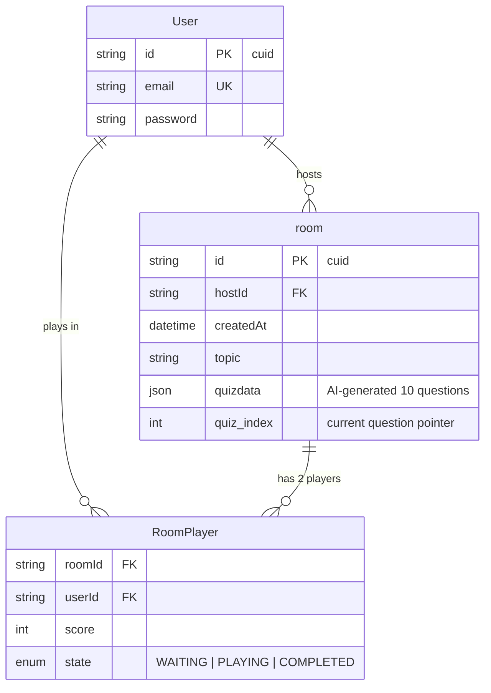
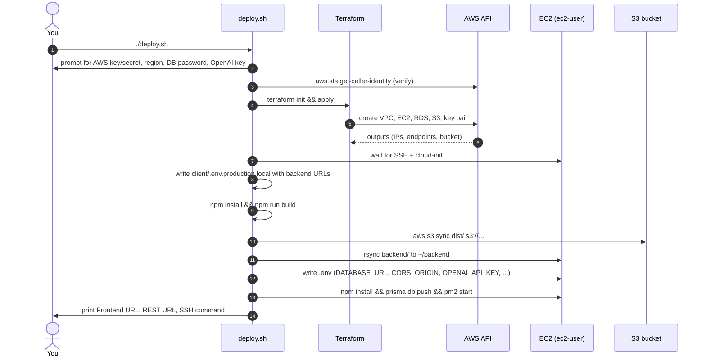

# QuizCompetitionMaker

A 1-v-1 real-time quiz competition platform. Two players join a room, the
backend generates a 10-question quiz with AI, and Socket.IO drives the live
play — synchronised questions, server-side timers, instant scoring, and
graceful pause/resume on disconnect.

- **Frontend:** React 19 + Vite + Tailwind, hosted on **S3 static website**
- **Backend:** Express 5 + Socket.IO 4, running on **EC2** under **pm2**
- **Database:** **RDS Postgres 15** in **private subnets**, reachable only from the backend
- **AI:** OpenAI-compatible endpoint (AWS Bedrock) for quiz generation
- **Infra:** Terraform modules (network / backend / db / frontend) + a single `./deploy.sh`

---

## Table of contents

1. [High-level architecture](#high-level-architecture)
2. [AWS network architecture (VPC, public + private subnets)](#aws-network-architecture-vpc-public--private-subnets)
3. [How frontend and backend talk to each other](#how-frontend-and-backend-talk-to-each-other)
4. [End-to-end code flow (one full match)](#end-to-end-code-flow-one-full-match)
5. [Backend module layout](#backend-module-layout)
6. [Frontend module layout](#frontend-module-layout)
7. [Database schema](#database-schema)
8. [Deploy flow](#deploy-flow)
9. [Prerequisites](#prerequisites)
10. [One-command deploy](#one-command-deploy)
11. [Tearing it down](#tearing-it-down)
12. [Re-deploy / update](#re-deploy--update)
13. [Local development](#local-development)
14. [Troubleshooting](#troubleshooting)
15. [Full repo layout](#full-repo-layout)

---

## High-level architecture

```
              ┌─────────────────┐
              │     BROWSER     │
              │   (React SPA)   │
              └────────┬────────┘
                       │
        ┌──────────────┼──────────────┐
        │              │              │
   HTTP │         REST │     Socket.IO│
   GET  │        :4000 │         :9000│
        ▼              ▼              ▼
   ┌─────────┐    ┌─────────────────────┐
   │   S3    │    │       EC2           │
   │frontend │    │  Node 20 + pm2      │
   │ bucket  │    │  Express + Socket   │
   └─────────┘    └──────────┬──────────┘
                             │ Prisma
                             │ :5432
                             ▼
                       ┌──────────┐
                       │   RDS    │
                       │ Postgres │
                       │ (private)│
                       └──────────┘
```

Three blocks, three responsibilities:

| Block         | What it does                                           | Reachable from        |
| ------------- | ------------------------------------------------------ | --------------------- |
| **S3**        | Serves the React bundle (HTML/JS/CSS)                  | Anyone on the internet |
| **EC2**       | Runs the Node app — REST + Socket.IO                   | Anyone on `4000`/`9000`, SSH from your IP |
| **RDS**       | Postgres database                                      | Only the EC2 (via SG) |

| Layer    | Service                           | Notes                                                       |
| -------- | --------------------------------- | ----------------------------------------------------------- |
| Frontend | S3 static-website bucket          | Public-read, `index.html` is also the SPA fallback (404 → index) |
| Backend  | EC2 (Amazon Linux 2023, t3.micro) | Node 20 + pm2, ports 4000 (REST) and 9000 (Socket.IO)       |
| Database | RDS Postgres 15 (db.t3.micro)     | `publicly_accessible = false`, SG only allows the backend SG |
| Network  | 1 public subnet + 2 private subnets | RDS subnet group needs ≥ 2 AZs                            |
| SSH      | Locked to the deployer's public IP | Auto-detected via `checkip.amazonaws.com`                  |

---

## AWS network architecture (VPC, public + private subnets)

The VPC is `10.0.0.0/16`, carved into:

| Subnet                 | CIDR              | AZ           | Internet route?           | What lives there      |
| ---------------------- | ----------------- | ------------ | ------------------------- | --------------------- |
| `quiz-public`          | `10.0.1.0/24`     | AZ #1        | Yes — via Internet Gateway | Backend EC2           |
| `quiz-private-0`       | `10.0.10.0/24`    | AZ #1        | No                        | RDS (in subnet group) |
| `quiz-private-1`       | `10.0.11.0/24`    | AZ #2        | No                        | RDS (in subnet group) |

```
                       ┌──────────────┐
                       │   INTERNET   │
                       └──────┬───────┘
                              │
                       ┌──────▼───────┐
                       │  Internet GW │
                       └──────┬───────┘
                              │
   ┌──────────────────────────┼──────────────────────────┐
   │ VPC 10.0.0.0/16          │                          │
   │                          ▼                          │
   │   ┌─────────────────────────────────────────────┐   │
   │   │ PUBLIC SUBNET   10.0.1.0/24    (AZ-1)       │   │
   │   │                                             │   │
   │   │      ┌────────────────────────────┐         │   │
   │   │      │  EC2 Backend (public IP)   │         │   │
   │   │      │  SG: 22 from YOUR IP only  │         │   │
   │   │      │      4000 + 9000 → world   │         │   │
   │   │      └─────────────┬──────────────┘         │   │
   │   └────────────────────┼─────────────────────────┘  │
   │                        │ port 5432                  │
   │                        │ (VPC-internal)             │
   │   ┌────────────────────▼─────────────────────────┐  │
   │   │ PRIVATE SUBNETS  10.0.10.0/24 + 10.0.11.0/24 │  │
   │   │                  (AZ-1)        (AZ-2)        │  │
   │   │      ┌────────────────────────────┐          │  │
   │   │      │  RDS Postgres              │          │  │
   │   │      │  publicly_accessible=false │          │  │
   │   │      │  SG: 5432 from backend SG  │          │  │
   │   │      └────────────────────────────┘          │  │
   │   │                                              │  │
   │   │  NO route to 0.0.0.0/0 — no internet access  │  │
   │   └──────────────────────────────────────────────┘  │
   └─────────────────────────────────────────────────────┘
```

### Why two private subnets?

RDS requires its **DB subnet group** to span at least **2 Availability Zones**
(this is what makes Multi-AZ failover possible later). The DB instance itself
only runs in one of them at a time, but the subnet group must list both.

### Why a private subnet at all?

- **No public IP on Postgres.** `publicly_accessible = false` means RDS gets
  no public DNS — there is literally no route from the internet to port 5432.
- **No `0.0.0.0/0` in the private route table.** Even if something inside the
  private subnet tried to reach the internet, it can't (no IGW, no NAT). RDS
  has nothing to call out to anyway.
- **SG-to-SG ingress.** The Postgres SG accepts `tcp/5432` *only* from the
  backend EC2's security group (`security_groups = [var.backend_sg_id]`).
  This is stricter than a CIDR rule — even if someone else launches an
  instance in the public subnet, they can't reach the DB unless they attach
  the backend's SG.

### Security group summary

| SG                   | Inbound rules                                                | Notes                                  |
| -------------------- | ------------------------------------------------------------ | -------------------------------------- |
| `quiz-backend-sg`    | `22/tcp` from `<your IP>/32`, `4000/tcp` + `9000/tcp` from `0.0.0.0/0` | SSH locked to operator, app ports world-open |
| `quiz-postgres-sg`   | `5432/tcp` from `quiz-backend-sg` (security-group reference) | No CIDR rule at all                    |

### S3 static website (intentionally NOT in the VPC)

S3 is a regional service that lives outside the VPC. The frontend bucket has:

- `block_public_acls = false` + a bucket policy granting `s3:GetObject` to `Principal *` (public read)
- Static website hosting enabled, with `index.html` set as **both** the index
  doc and the error doc — that's the SPA fallback for client-side routes
  (`/rooms/:id/play` resolves to `index.html` instead of a 404 page)

---

## How frontend and backend talk to each other

There are **two transport channels**, and they're used for very different things:

```
   ┌────────────────────────────┐         ┌──────────────────────────┐
   │       BROWSER (SPA)        │         │       EC2 Backend        │
   │                            │         │                          │
   │   Pages + Components       │         │                          │
   │       │                    │         │                          │
   │       ├──► lib/auth.js     │         │                          │
   │       │    (localStorage)  │         │                          │
   │       │                    │         │                          │
   │       ├──► lib/api.js  ────┼──HTTP──▶│  Express :4000 (REST)    │
   │       │    (fetch)         │  JSON   │           │              │
   │       │                    │         │           ▼              │
   │       └──► lib/socket.js ──┼──WS────▶│  Socket.IO :9000         │
   │            (socket.io)     │ upgrade │           │              │
   │                            │         │           ▼              │
   │                            │         │   Prisma → RDS Postgres  │
   └────────────────────────────┘         └──────────────────────────┘
```

### REST channel — `http://<EC2_IP>:4000` (Express)

Used for **one-shot, request/response** operations. No persistent connection.

| Method | Path                | Purpose                                   |
| ------ | ------------------- | ----------------------------------------- |
| POST   | `/user/register`    | Create an account                         |
| POST   | `/user/login`       | Authenticate, returns user id             |
| GET    | `/user/me/:id`      | Fetch own profile                         |
| POST   | `/room/create`      | Create room + generate AI quiz            |
| GET    | `/room/:id`         | Look up a room (used by JoinRoomPage)     |
| GET    | `/room`             | List rooms                                |
| PUT    | `/room/:id`         | Update room metadata                      |
| DELETE | `/room/:id`         | Delete a room                             |
| GET    | `/health`           | Liveness check                            |

CORS allowlist is controlled by `CORS_ORIGIN` env var (the deploy script sets
it to the S3 website URL + `http://localhost:5173`).

### Socket.IO channel — `http://<EC2_IP>:9000` (WebSocket)

Used for **live gameplay** — everything that has to be pushed to both players
at the same time. Each client opens **one** socket when it lands on the game
page; the connection carries `userId` (and optionally `roomId`) as query
params and is authenticated by `ConnectionValidation` middleware on the
server.

| Event                  | Direction         | Payload                                                       |
| ---------------------- | ----------------- | ------------------------------------------------------------- |
| `join-room`            | client → server   | `roomId` — adds the player; if room hits 2 players, game starts |
| `start-game`           | server → room     | `{ roomId, questions, timeLimit }` — first question + per-question budget |
| `submit-answer`        | client → server   | `{ roomId, chosenOption }` — recorded in `answersThisRound`   |
| `send-question`        | server → room     | `{ question, timeLimit }` — next question after a round closes |
| `round-result`         | server → room     | `{ questionIndex, correctAnswer, players[] }` — reveal + per-player score |
| `opponent-left`        | server → room     | `{ reconnectWindowMs }` — game pauses, opponent has 60s to come back |
| `game-resumed`         | server → room     | `{ remainingMs, question }` — opponent reconnected within the window |
| `game-ended`           | server → room     | `{ reason, scores, winnerUserId, tie }`                       |
| `room-update`          | client → server   | Update a player's score / state row                           |
| `disconnect`           | (built-in)        | Triggers pause-and-wait flow on the server                    |

### In-memory room state (server)

Socket.IO holds a `roomState[roomId]` map that's the single source of truth
during a live match — it's the bridge between the two players' sockets and
the question timer:

```js
roomState[roomId] = {
  status: "PLAYING" | "PAUSED" | "ENDED",
  players: [userId, userId],          // for winner lookup without a DB hit
  currentQuestionIndex,
  questionTimer, questionStartedAt, questionRemaining,
  disconnectTimer, disconnectedUserId,
  answersThisRound: Map<userId, { questionIndex, chosenOption }>,
}
```

The next question fires when **either**:

1. Both players have submitted (`answersThisRound.size === 2`), or
2. The 10-second `questionTimer` expires.

`handleNextQuestion` clears whichever path didn't win, grades the round,
emits `round-result`, then emits the next `send-question`.

---

## End-to-end code flow (one full match)

```mermaid
sequenceDiagram
    autonumber
    actor P1 as Player 1
    actor P2 as Player 2
    participant FE as React SPA<br/>(served from S3)
    participant API as Express :4000
    participant WS as Socket.IO :9000
    participant AI as OpenAI / Bedrock
    participant DB as RDS Postgres

    P1->>FE: open https://&lt;s3-website&gt;/
    FE->>API: POST /user/login
    API->>DB: find user, check password
    DB-->>API: user row
    API-->>FE: { id, email }
    FE->>FE: saveUser() in localStorage

    P1->>FE: "Create room" → topic + difficulty
    FE->>API: POST /room/create
    API->>AI: generateQuiz({ description, difficulty })
    AI-->>API: 10 questions JSON
    API->>DB: insert room (quizdata JSON, host_id)
    DB-->>API: roomId
    API-->>FE: { roomId }
    FE->>FE: navigate /rooms/:id/play
    FE->>WS: connect (query: userId, roomId)
    WS->>WS: ConnectionValidation
    FE->>WS: emit "join-room"
    WS->>DB: addInRoomPlayer (P1)
    Note over WS: only 1 player so far → waiting

    P2->>FE: paste room code → JoinRoomPage
    FE->>API: GET /room/:id (verify exists)
    FE->>WS: connect + emit "join-room"
    WS->>DB: addInRoomPlayer (P2)
    Note over WS: room size == 2 → game starts

    WS->>DB: getCurrentQuestion (quiz_index = 0)
    WS-->>P1: "start-game" { question, timeLimit: 10000 }
    WS-->>P2: "start-game" { question, timeLimit: 10000 }
    WS->>WS: setTimeout(handleNextQuestion, 10000)

    par
        P1->>WS: emit "submit-answer" { chosenOption }
    and
        P2->>WS: emit "submit-answer" { chosenOption }
    end
    WS->>WS: answersThisRound.size == 2 → advance early
    WS->>DB: evaluateAnswer x2 (updates RoomPlayer.score)
    WS-->>P1: "round-result" { correctAnswer, players }
    WS-->>P2: "round-result" { correctAnswer, players }
    WS->>DB: updateQuestionIndex (++quiz_index)
    WS-->>P1: "send-question" { next question }
    WS-->>P2: "send-question" { next question }

    Note over WS,DB: ... repeats for 10 questions ...

    WS->>DB: getScores
    WS-->>P1: "game-ended" { scores, winnerUserId }
    WS-->>P2: "game-ended" { scores, winnerUserId }
    FE->>FE: navigate /rooms/:id/results
```

### Disconnect / reconnect sub-flow

If P2's tab closes mid-game, the server doesn't immediately end the match:

1. `disconnect` handler freezes `questionTimer`, snapshots `questionRemaining`.
2. `status` → `PAUSED`, emits `opponent-left` to P1 with `reconnectWindowMs: 60000`.
3. Starts `disconnectTimer` (60s).
4. If P2's new socket fires `join-room` *with the same userId* before the
   timer expires → server resumes: re-emits `game-resumed` with the same
   `remainingMs`, restarts the per-question timer for the leftover time.
5. If the 60s elapses → `handleOpponentTimeout` declares P1 the winner via
   `game-ended { reason: "opponent-timeout" }`.

---

## Backend module layout

```mermaid
flowchart LR
    server[server.js<br/>Express app + CORS<br/>mounts routers<br/>imports socket/index.js]

    server --> userR[user/user.routes.js]
    server --> roomR[room/room.routes.js]
    server --> sockI[socket/index.js<br/>io = new Server&#40;:9000&#41;]

    userR --> userC[user.controller.js]
    userC --> userS[user.service.js]
    userS --> userRepo[user.repo.js]

    roomR --> roomC[room.controller.js]
    roomC --> roomS[room.service.js]
    roomS --> roomRepo2[room.repo.js]
    roomS --> quizS[quiz/quiz.service.js<br/>OpenAI client]

    sockI --> joinR[rooms/join-room.js]
    sockI --> timerH[timer/socket.timer.js<br/>handleNextQuestion<br/>handleOpponentTimeout]
    sockI --> quizH[quiz/socket.quiz.js<br/>handleSumbitAnswer]
    sockI --> connV[socket_validation.js]

    userRepo --> prisma[(Prisma Client)]
    roomRepo2 --> prisma
    prisma --> rds[(RDS Postgres)]

    classDef route fill:#fff3cd,stroke:#b58900;
    classDef sock fill:#d9edf7,stroke:#31708f;
    class userR,roomR,userC,roomC route;
    class sockI,joinR,timerH,quizH,connV sock;
```



Each domain folder follows the same **routes → controller → service → repo**
pattern (with a `*.validation.js` for input checks and a `*.test.js` for
ad-hoc tests):

| Folder                     | Responsibility                                                         |
| -------------------------- | ---------------------------------------------------------------------- |
| `src/modules/user/`        | Auth (register/login), `/user/me/:id`                                  |
| `src/modules/room/`        | Room CRUD + adding players + score updates                             |
| `src/modules/quiz/`        | OpenAI-compat quiz generation, current-question lookup, answer grading |
| `src/modules/socket/`      | All real-time logic; subfolders by concern (rooms, quiz, timer)        |
| `src/modules/game/`        | `GameManager` helper (currently thin wrappers over `io.emit`)          |
| `prisma/schema.prisma`     | DB schema (User / room / RoomPlayer)                                   |

---

## Frontend module layout

```mermaid
flowchart LR
    main[main.jsx<br/>BrowserRouter + App]
    main --> app[App.jsx<br/>RequireAuth wrapper]

    app --> auth[/auth/<br/>AuthPage.jsx]
    app --> home[/<br/>HomePage.jsx]
    app --> create[/rooms/new<br/>CreateRoomPage.jsx]
    app --> join[/rooms/join<br/>JoinRoomPage.jsx]
    app --> game[/rooms/:id/play<br/>GamePage.jsx]
    app --> results[/rooms/:id/results<br/>ResultsPage.jsx]

    auth --> apiLib[lib/api.js]
    home --> apiLib
    create --> apiLib
    join --> apiLib
    game --> apiLib
    game --> sockLib[lib/socket.js]

    apiLib -->|fetch :4000| backendREST[Express REST]
    sockLib -->|WS :9000| backendWS[Socket.IO]
    auth --> authLib[lib/auth.js<br/>localStorage]

    classDef page fill:#e7e7ff,stroke:#5b5bd6;
    classDef lib fill:#dff0d8,stroke:#3c763d;
    class auth,home,create,join,game,results page;
    class apiLib,sockLib,authLib lib;
```

| File / folder                          | Role                                                |
| -------------------------------------- | --------------------------------------------------- |
| `src/main.jsx`                         | Bootstraps React + `BrowserRouter`                  |
| `src/App.jsx`                          | Route table + `RequireAuth` HOC                     |
| `src/lib/api.js`                       | Thin `fetch` wrapper, exports `api.{register,login,createRoom,...}` |
| `src/lib/socket.js`                    | `connectSocket / getSocket / disconnectSocket` helpers |
| `src/lib/auth.js`                      | `saveUser / getUser / clearUser` (localStorage)     |
| `src/pages/Auth/AuthPage.jsx`          | Login + register tabs                               |
| `src/pages/Home/HomePage.jsx`          | Landing, links to create / join                     |
| `src/pages/Room/CreateRoomPage.jsx`    | Topic + difficulty form, POSTs `/room/create`       |
| `src/pages/Room/JoinRoomPage.jsx`      | Paste room id, validates via `GET /room/:id`        |
| `src/pages/Game/GamePage.jsx`          | Opens the socket, drives the entire live match     |
| `src/pages/Results/ResultsPage.jsx`    | Final scores + winner banner                        |
| `src/components/cards/AuthCard.jsx`    | Shared auth form card                               |

Env config is read from `import.meta.env`:

- `VITE_API_URL` → REST base (defaults to `http://localhost:4000`)
- `VITE_SOCKET_URL` → Socket.IO base (defaults to `http://localhost:5000`)

The deploy script writes these into `client/.env.production.local` pointing
at the EC2 public IP **before** running `vite build`, so the bundle that
lands on S3 has the production URLs hard-coded.

---

## Database schema



`quiz_index` is the **server-authoritative** pointer to the current question
— it's incremented inside `roomRepo.updateQuestionIndex` after every round,
so a refresh of the GamePage can recover the right question without trusting
the client.

---

## Deploy flow



---

## Prerequisites

Install once on the machine that will run the deploy:

| Tool       | macOS install              | What it does                                   |
| ---------- | -------------------------- | ---------------------------------------------- |
| terraform  | `brew install terraform`   | Provisions AWS                                 |
| aws CLI v2 | `brew install awscli`      | Used to sync the frontend build to S3          |
| node 20+   | `brew install node`        | Builds the Vite client locally                 |
| jq         | `brew install jq`          | Parses terraform outputs in the script         |
| ssh / scp / rsync | preinstalled        | Ships the backend code to EC2                  |

You also need an AWS account with permission to create VPC / EC2 / RDS / S3 /
IAM resources, and an OpenAI API key (the backend won't start without it).

---

## One-command deploy

```bash
./deploy.sh
```

The script will interactively prompt for:

1. **AWS access key + secret** (and optional session token if you're using SSO)
2. **AWS region** — default `eu-north-1`
3. **Postgres master password** — used by RDS *and* baked into the backend's `DATABASE_URL`
4. **OpenAI API key** — required (the backend uses an OpenAI-compatible Bedrock endpoint)

Nothing is written to disk except `infra/terraform.tfvars` (the DB password,
gitignored) and `infra/quiz-key.pem` (the EC2 SSH key, gitignored). Creds stay
in environment variables for the lifetime of the script.

At the end you'll get a banner with the **frontend URL**, **REST/Socket URLs**,
and a ready-to-paste SSH command.

### What's actually happening, step by step

1. **Prereq check** — fails fast if `terraform`, `aws`, `node`, `jq`, etc. are missing.
2. **Cred prompt** — `read -s` for the secret, exported to the shell only.
3. **`aws sts get-caller-identity`** — confirms the keys work before spending 10 min on terraform.
4. **`terraform init && apply`** — provisions VPC, subnets, EC2, RDS, S3, key pair, security groups. The SSH SG ingress is locked to *your* current public IP (looked up at apply time via `checkip.amazonaws.com`).
5. **Cloud-init wait** — EC2 user_data installs Node 20, git, and pm2; the script blocks on `cloud-init status --wait` so we don't SSH in mid-install.
6. **Frontend build** — writes `client/.env.production.local` with
   `VITE_API_URL=http://<EC2_IP>:4000` and `VITE_SOCKET_URL=http://<EC2_IP>:9000`,
   then runs `npm install && npm run build`.
7. **S3 sync** — `aws s3 sync client/dist/ s3://<bucket>/ --delete`.
8. **Backend ship** — `rsync` of `backend/` (excluding `node_modules`, `.env`, Prisma's `generated/`) to `~/backend` on EC2.
9. **Remote `.env`** — written over SSH with `umask 077` so it's `0600`.
10. **`npm install --omit=dev && prisma generate && prisma db push`** — syncs the schema to RDS (no migrations folder, so `db push` not `migrate deploy`).
11. **`pm2 start server.js --name quiz-backend`** — re-startable via `pm2 restart`.

---

## Tearing it down

```bash
./destroy.sh
```

Same cred prompts. The script empties the S3 bucket first (terraform can't
delete a non-empty bucket) and then `terraform destroy`s everything. Local
`terraform.tfvars` and `quiz-key.pem` are *not* deleted — remove them yourself
if you want a fully clean slate.

---

## Re-deploy / update

Just re-run `./deploy.sh`. Every step is idempotent:

- `terraform apply` is a no-op when nothing changed
- `aws s3 sync --delete` updates only changed files
- `rsync` only ships diffs
- `pm2 delete quiz-backend || true && pm2 start ...` swaps the running process

To redeploy only the frontend after a UI change:

```bash
cd client
npm run build
aws s3 sync dist/ s3://$(cd ../infra && terraform output -raw frontend_bucket)/ --delete
```

To redeploy only the backend after a server change:

```bash
KEY=$(cd infra && terraform output -raw ssh_key_path)
IP=$(cd infra && terraform output -raw backend_public_ip)
rsync -az --exclude node_modules --exclude .env -e "ssh -i $KEY" backend/ ec2-user@$IP:~/backend/
ssh -i $KEY ec2-user@$IP 'cd ~/backend && npm install --omit=dev && pm2 restart quiz-backend'
```

---

## Local development

```bash
# backend
cd backend
cp .env.example .env   # if you have one; otherwise create it
npm install
npx prisma generate
npm run dev            # nodemon on :4000 (REST) and :5000 (Socket.IO)

# client
cd client
npm install
npm run dev            # vite on http://localhost:5173
```

The client's `VITE_API_URL` / `VITE_SOCKET_URL` default to `http://localhost:4000` /
`http://localhost:5000` when no `.env` is set.

---

## Troubleshooting

| Symptom                                    | Likely cause / fix                                                                 |
| ------------------------------------------ | ---------------------------------------------------------------------------------- |
| `aws sts get-caller-identity` fails        | Wrong key/secret, expired SSO token, or wrong region                               |
| `terraform apply` hangs on RDS for 10+ min | Normal — RDS create can take 5–10 min on first run                                 |
| SSH wait loop times out                    | Re-run; EC2 sometimes takes >5 min to come up. Check the AWS console for the instance state |
| Frontend loads but API calls fail with CORS | Check `~/backend/.env` on EC2 — `CORS_ORIGIN` should include the S3 website URL    |
| `pm2 logs quiz-backend` shows Prisma errors | `DATABASE_URL` in `~/backend/.env` is wrong, or the RDS SG isn't letting the backend in |
| Browser can't reach the backend            | Backend SG only opens 4000/9000 to the world — confirm the EC2 instance is `running` |
| Socket connects but "join-room" never fires | `VITE_SOCKET_URL` is wrong in the built bundle — rebuild + re-sync to S3          |

Useful one-liners after a deploy:

```bash
# Tail backend logs
ssh -i infra/quiz-key.pem ec2-user@$(cd infra && terraform output -raw backend_public_ip) \
    'pm2 logs quiz-backend --lines 100'

# Open a psql shell against RDS (via the EC2 box — RDS isn't reachable from your laptop)
ssh -i infra/quiz-key.pem ec2-user@$(cd infra && terraform output -raw backend_public_ip) \
    "PGPASSWORD='YOUR_PASSWORD' psql -h $(cd infra && terraform output -raw db_endpoint) -U auth_quiz_vaibhav -d quizdb"
```

---

## Full repo layout

```
QuizCompetitonMaker/
├── deploy.sh                      # one-command provision + deploy (interactive)
├── destroy.sh                     # tear-down (interactive)
├── README.md
├── .gitignore
│
├── infra/                         # Terraform — everything AWS-side
│   ├── main.tf                    # Wires modules together, generates SSH key pair
│   ├── variables.tf               # aws_region, project, db_password, app_ports
│   ├── outputs.tf                 # backend_public_ip, db_endpoint, frontend_url, ...
│   ├── terraform.tf               # required_providers + backend config
│   ├── terraform.tfvars           # gitignored — holds db_password
│   ├── quiz-key.pem               # gitignored — generated EC2 SSH key
│   └── module/
│       ├── network/
│       │   ├── vpc.tf             # VPC, IGW, 1 public + 2 private subnets, route tables
│       │   └── outputs.tf         # vpc_id, public_subnet_id, private_subnet_ids
│       ├── backend/
│       │   ├── ec2.tf             # EC2 t3.micro + SG (SSH from your IP + 4000/9000 world) + cloud-init
│       │   └── outputs.tf         # public_ip, public_dns, security_group_id
│       ├── db/
│       │   └── rds-postgress.tf   # RDS Postgres 15, DB subnet group, SG (5432 from backend SG only)
│       └── frontend/
│           ├── s3.tf              # Bucket + public-read policy + static-website config
│           └── outputs.tf         # bucket_name, website_url
│
├── backend/                       # Express + Socket.IO + Prisma
│   ├── server.js                  # App entry — mounts routers, imports socket/index.js
│   ├── package.json
│   ├── prisma.config.ts
│   ├── prisma/
│   │   ├── schema.prisma          # User / room / RoomPlayer / UserStatus enum
│   │   └── models/
│   │       └── user.prisma        # (split model file)
│   └── src/
│       └── modules/
│           ├── user/              # routes → controller → service → repo (+ validation, test)
│           │   ├── user.routes.js
│           │   ├── user.controller.js
│           │   ├── user.service.js
│           │   ├── user.repo.js
│           │   ├── user.validation.js
│           │   └── user.test.js
│           ├── room/              # Room CRUD + add player + score updates
│           │   ├── room.routes.js
│           │   ├── room.controller.js
│           │   ├── room.service.js
│           │   ├── room.repo.js
│           │   ├── room.validation.js
│           │   └── room.test.js
│           ├── quiz/              # OpenAI quiz generation + question lookup + grading
│           │   ├── quiz.service.js
│           │   ├── quiz.validation.js
│           │   ├── index.js
│           │   └── quiz.test.js
│           ├── game/
│           │   └── gamemanager.js # Thin helper around io.emit
│           └── socket/            # All real-time wiring
│               ├── index.js                       # io = new Server(:9000) + connection handler
│               ├── socket_validation.js           # validates userId on connect
│               ├── update-user-state.js
│               ├── rooms/
│               │   ├── join-room.js               # add player → DB, socket.join(room)
│               │   └── sockets.room.validation.js
│               ├── quiz/
│               │   ├── socket.quiz.js             # handleSumbitAnswer
│               │   └── sockets.quiz.validation.js
│               └── timer/
│                   └── socket.timer.js            # handleNextQuestion + handleOpponentTimeout
│
└── client/                        # Vite + React 19 + Tailwind 4
    ├── index.html
    ├── vite.config.js
    ├── tailwind.config.js
    ├── postcss.config.js
    ├── package.json
    ├── .env.example               # VITE_API_URL + VITE_SOCKET_URL placeholders
    └── src/
        ├── main.jsx               # BrowserRouter + App
        ├── App.jsx                # Routes + RequireAuth HOC
        ├── index.css              # Tailwind entry
        ├── lib/
        │   ├── api.js             # fetch wrapper for REST :4000
        │   ├── socket.js          # socket.io-client wrapper for :9000
        │   └── auth.js            # localStorage user helpers
        ├── components/
        │   └── cards/
        │       └── AuthCard.jsx
        └── pages/
            ├── Auth/AuthPage.jsx
            ├── Home/HomePage.jsx
            ├── Room/CreateRoomPage.jsx
            ├── Room/JoinRoomPage.jsx
            ├── Game/GamePage.jsx
            └── Results/ResultsPage.jsx
```
